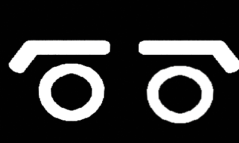
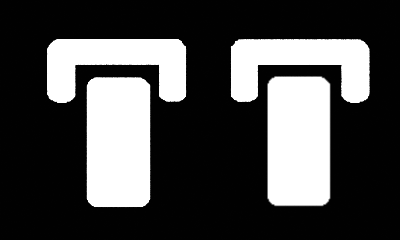
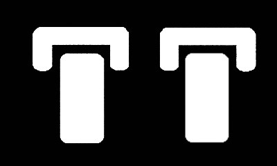
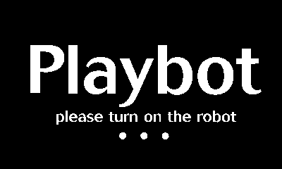
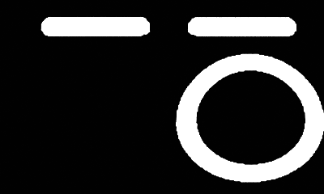
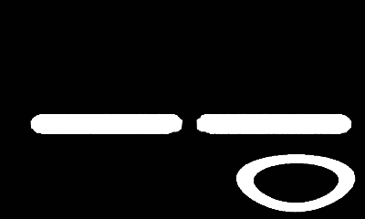

# Playbot State Machine & Behavior System

## Overview
The Playbot uses a flexible state machine system written in Lua that manages the robot's behaviors through states and transitions. The system consists of two main components:
- **State Machine**: Handles state management, transitions, and animations
- **Behaviors**: Define sets of states and their relationships for different robot modes

## Dependencies
- [Noble Engine](https://github.com/NobleRobot/NobleEngine) by [NobleRobot](https://github.com/NobleRobot) - Game engine framework for Playdate
- [animatedImage](https://github.com/mierau/playdate-animatedimage) by [Dustin Mierau](https://github.com/mierau) - Animation library for Playdate

## State Machine Features
- Weighted random transitions between states
- Conditional transitions based on sensor inputs
- Animation and sound synchronization
- Teensy command integration
- Multiple behavior support
- Resource management for animations and sounds

## Creating a New Behavior

### 1. Create Behavior File
Create a new file in the `Behaviors` directory:

```lua
local MyBehavior = {}

function MyBehavior:new()
    local behavior = {}
    setmetatable(behavior, self)
    self.__index = self
    behavior.scene = nil
    return behavior
end

function MyBehavior:setScene(scene)
    self.scene = scene
end

function MyBehavior:setup(stateMachine)
    -- Define states here
end

return MyBehavior
```

### 2. Define States
Each state requires:
```lua
stateMachine:addState(
    "stateName",                -- Unique identifier
    {                          -- Animation/Sound pairs
        {
            animation = {
                path = "Assets/Images/Path", 
                options = { delay = 33.333, loop = false }
            },
            sound = "Assets/sounds/soundFile"
        }
    },
    {                          -- Next state(s)
        { state = "nextState", weight = 1 }
    },
    "teensyCommand",           -- Command sent to Teensy
    {                          -- Conditional transitions
        {
            condition = function() return self.scene:someCondition() end,
            nextState = "conditionalState"
        }
    }
)
```

### 3. Register the Behavior
In your main scene:
```lua
local MyBehavior = import 'Behaviors/MyBehavior'
local myBehavior = MyBehavior:new()
myBehavior:setScene(self)
self.stateMachine:addBehavior("myBehavior", myBehavior, "initialState")
```

## State Configuration

### Animation/Sound Pairs
- `path`: Path to animation files
- `options`: Animation settings (delay, loop)
- `sound`: Path to sound file (optional)

### Transitions
- `state`: Target state name
- `weight`: Probability weight for random transitions
- `condition`: Function returning boolean for conditional transitions

### Teensy Commands
Format: `"commandType/parameters"`
- `"a/"`: Animation command
- `"b/"`: Battery check
- `"d/"`: Sensor data request

## Example Behavior
```lua
function ExampleBehavior:setup(stateMachine)
    -- First state with Teensy command
    stateMachine:addState(
        "idle",
        {
            {
                animation = {
                    path = "Assets/Images/Faces/Idle",
                    options = { delay = 33.333, loop = true }
                },
                sound = nil
            }
        },
        {
            { state = "idle02", weight = 0.7 },
            { state = "sleep", weight = 0.3 }
        },
        "a/Idle",
        {
            {
                condition = function() 
                    return self.scene:detectTapOrBump() 
                end,
                nextState = "idle02"
            }
        }
    )

    -- Second state without Teensy command
    stateMachine:addState(
        "idle02",
        {
            {
                animation = {
                    path = "Assets/Images/Faces/Idle_02",
                    options = { delay = 33.333, loop = false }
                },
                sound = nil
            }
        },
        {
            { state = "idle", weight = 1 }
        },
        "c/",  -- No Teensy command needed
        {
            {
                condition = function() 
                    return self.scene:detectTapOrBump() 
                end,
                nextState = "idle"
            }
        }
    )
end
```
# Animation Files Reference

## Available Animations and Sounds:
| Animation Name | Preview | Associated Sound |
|---------------|---------|------------------|
| Blink_01 |  | - |
| Collide_01 |  | Collide_01.wav |
| Collide_02 |  | - |
| CrankTurn |  | FishingRod_03.wav |
| Edge_01 |  | Edge.wav |
| FallAsleep |  | - |
| Forward_Medium |  | - |
| Idle_01 |  | Idle_01.wav |
| Idle_02 |  | Idle_02.wav |
| Idle_03 |  | Idle_03.wav |
| Idle_04 |  | - |
| Intro_Loop |  | Intro_Loop.wav |
| Intro_Start |  | Intro_Start.wav |
| Intro_Stop |  | Intro_Stop.wav |
| LookAtCrank |  | - |
| Plug |  | ChargeON.wav |
| Sleeping |  | Snoring.wav |
| Turn_90_Left |  | Turn_90.wav |
| Turn_90_Right |  | Turn_90.wav |
| WakeUp |  | WakeUp.wav |

All animations are formatted as 400x240 pixel table-mode GIFs for the Playdate SDK.
Sound files are in WAV ADPCM format.

